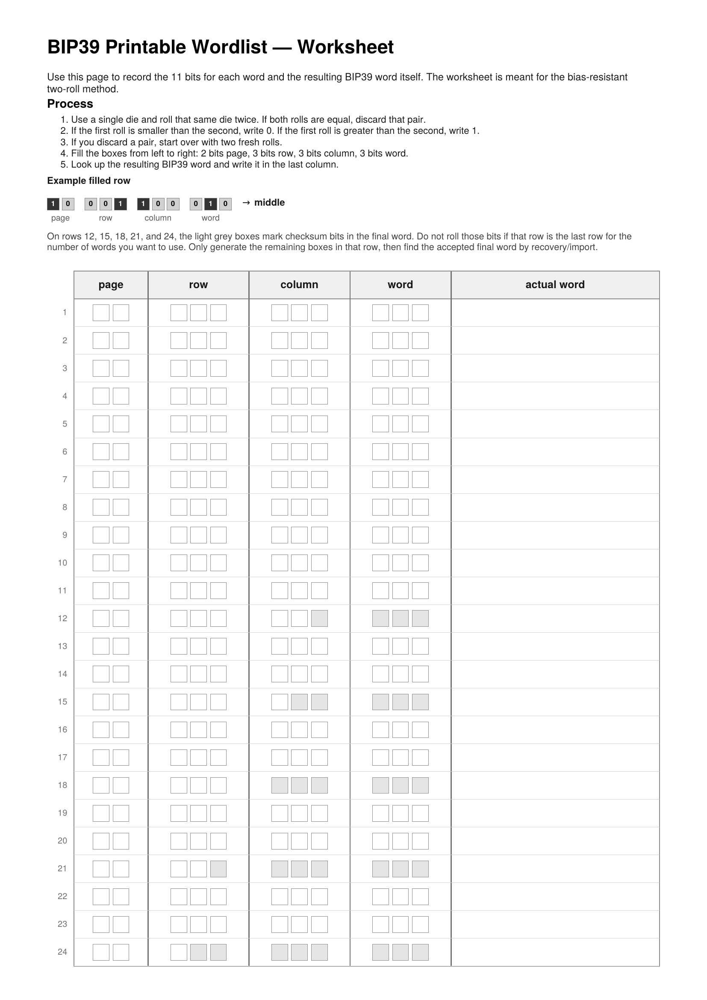
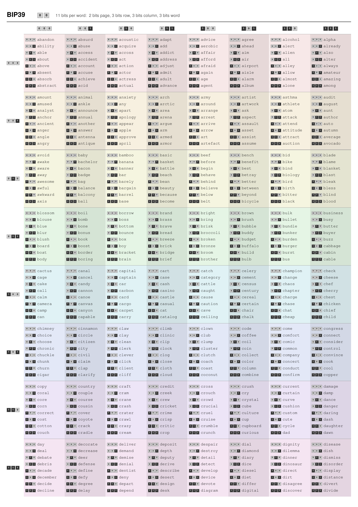

# BIP39 Printable Wordlist

A printable 6-page layout of the BIP39 English wordlist (2048 words): 1 manual page, 1 worksheet page, and 4 lookup pages. It is designed for fully offline word generation using your own physical randomness, whether you are rolling wallets or generating passphrases by hand. The goal is to make that manual process as easy and as error-resistant as possible. The bit-block layout maps 11 recorded bits directly to a BIP39 word on paper.

## Why

Software-based seed generation has a large attack surface: compromised RNGs, malware, clipboard sniffers, screen capture, or a backdoored hardware stack. Even an air-gapped computer still requires trusting its software and hardware chain.

This layout removes the digital part of the generation step. You produce the entropy yourself, record the bits, and look up the matching BIP39 word directly on paper. The pages are arranged to make rolling wallets or generating passphrases by hand simple to follow, less error-prone, and secure even when faced with low-quality dice.

## Preview

[](bip39_wordlist.pdf)
[](bip39_wordlist.pdf)
[](bip39_wordlist.pdf)

## Generating bits with a die

### Bias-resistant method

Use two rolls per attempt, always with a single die:

1. Roll the same die twice.
2. If both values are equal, discard the pair.
3. If the **first** roll is **smaller** than the second, record **0**.
4. If the **first** roll is **greater** than the second, record **1**.
5. If you discard a pair, start over with two fresh rolls.

So for example:

- `2, 5` → `0`
- `5, 2` → `1`
- `4, 4` → discard

For a fair die:

- ties happen with probability **1/6**
- accepted pairs happen with probability **5/6**
- one 11-bit word takes about **13.2 pairs** on average
- that is about **26.4 raw rolls** per word

In general, more sides are better. For a fair **n**-sided die, the discard probability is **1/n** because only equal pairs are rejected. So a d20 wastes fewer rolls than a d6. A fair d20 needs about **11.6 pairs** on average for one 11-bit word, i.e. about **23.2 raw rolls**.

### Why the math works even with an unfair die

Let the probability of face `i` be `p(i)`.

Pick any two distinct faces `a` and `b`.

The ordered pair `a, b` with `a < b` produces `0` and has probability:

- `p(a) p(b)`

The reversed pair `b, a` produces `1` and has probability:

- `p(b) p(a)`

These are equal:

- `p(a) p(b) = p(b) p(a)`

So for every pair of different faces, the chance that `a` comes before `b` is exactly the same as the chance that `b` comes before `a`. Summing over all such pairs gives:

- `P(0) = P(1)`

So the method stays unbiased even if the die itself is unfair, as long as successive rolls are independent enough for practical use. Shake well, and only use a **single die** so the face probabilities stay constant from roll to roll.

## How to look up a word

Record **11 bits**. Then split them into 4 groups:

```text
page   | 2 bits
row    | 3 bits
column | 3 bits
word   | 3 bits
```

Match each group against the dark/light blocks on the lookup pages:

1. **Page** — first 2 bits
2. **Row** — next 3 bits
3. **Column** — next 3 bits
4. **Word** — last 3 bits

Interpret:

- **dark = 1**
- **light = 0**

The worksheet page, right after the manual page, has empty boxes for `page`, `row`, `column`, and `word`, plus a final column where you can write the actual BIP39 word. It is meant for the bias-resistant two-roll method.

## Layout

Each word's 11-bit index is split into four visual levels:

| Bits | Level | How to find it |
|------|-------|----------------|
| 2 | Page (1 of 4) | Pick the right page |
| 3 | Row band (1 of 8) | Scan down to the colored band |
| 3 | Column (1 of 8) | Scan right to the column |
| 3 | Word (1 of 8) | Find the word in the group |

The 8 row bands per page have distinct background colors for quick scanning.

## Creating a wallet from the sheet

You can use the sheet to create a BIP39 wallet from your own physical randomness instead of trusting the random-number generator inside a hardware wallet.

Generate the words on paper first. Then open the **restore/import** flow on a trusted hardware wallet. This is the trick: do not let the wallet create a new phrase. Instead, enter the words you generated on paper as if the wallet already existed. In simple terms, restoring those words gives you the same wallet the device would have created if it had generated that exact phrase itself.

For most people, **12 words are enough** when they are generated securely. Longer phrases are possible, but they are not required just to get strong security. Trezor makes the same point for newer devices: [12 words are enough](https://trezor.io/learn/security-privacy/personal-security-standards/understanding-trezor-wallet-backups-12-20-or-24-words).

For a **12-word** phrase, generate the first **11 words** normally. For the **12th word**, only the first **7 bits** come from your own rolls. The last **4 bits** are a BIP39 checksum. They are there for error detection, so wallets can reject mistyped or otherwise invalid phrases. On the worksheet, those are the greyed fields in row 12. So after you have fixed the first 7 bits, there are **16** possible final words that fit that pattern.

Try those final words one by one in the wallet's restore/import screen. In other words, you are using the restore screen to test which final phrase is valid. The wallet will reject the wrong ones and accept the right one. The accepted phrase is your real mnemonic.

Expect about **8 tries on average**. Some wallets may make you enter all 12 words each time, so this can take quite some time.

The same idea works for longer phrases. On the worksheet, the greyed fields mark the bits you do not generate in the final row of a 12-, 15-, 18-, 21-, or 24-word phrase.

The same idea works for longer phrases:

- **12 words** → **16** candidates
- **15 words** → **32** candidates
- **18 words** → **64** candidates
- **21 words** → **128** candidates
- **24 words** → **256** candidates

Avoid websites or extra software for checking candidate phrases unless they are fully offline and truly trusted.

## Backing up the words

This project only helps with generation and lookup. Safe storage is a separate problem. Lose the phrase and the funds are unrecoverable; leak it and someone else can spend them.

## Exact mapping (optional)

You do not need this to use the sheet.

Read the 11 bits from left to right:

- bits **1-2** = page
- bits **3-5** = row
- bits **6-8** = column
- bits **9-11** = word

If you want the exact BIP39 list position, read the full 11-bit pattern as binary. The BIP39 wordlist counts from 0, so the **Nth** word uses binary(**N-1**).

Example: the **1123rd** word is `middle`.

- `1123 - 1 = 1122`
- `1122` in 11-bit binary is `10001100010`
- split into groups: `10 | 001 | 100 | 010`
- so: page `10`, row `001`, column `100`, word `010`

## Generating

Requires Python 3 and `reportlab`. PNG generation additionally requires `pdftoppm` (poppler).

```sh
# NixOS
nix-shell -p python3Packages.reportlab poppler-utils --run "python3 bip39_pages.py"

# pip
pip install reportlab
python3 bip39_pages.py
```

Produces `bip39_wordlist.pdf` and `page_1.png` through `page_6.png`.

## Files

- `english.txt` — BIP39 English wordlist (2048 words)
- `bip39_pages.py` — generator script
- `bip39_wordlist.pdf` — pre-built PDF
- `page_{1..6}.png` — pre-built page images

## References

- [BIP-0039](https://github.com/bitcoin/bips/blob/master/bip-0039.mediawiki)
- [BIP 39 on bips.dev](https://bips.dev/39/)
- [english.txt](https://github.com/bitcoin/bips/blob/master/bip-0039/english.txt)
- Ari Juels, Markus Jakobsson, Elizabeth A. M. Shriver, and Bruce Hillyer, ["How to Turn Loaded Dice into Fair Coins"](https://doi.org/10.1109/18.841170), *IEEE Transactions on Information Theory* 46(3), 2000

## License

MIT
